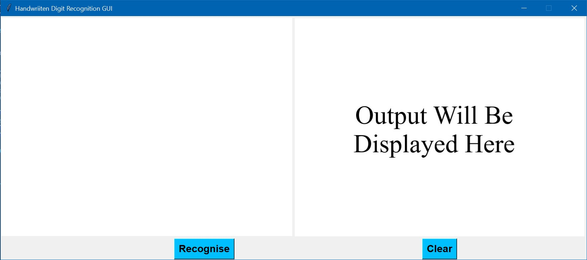
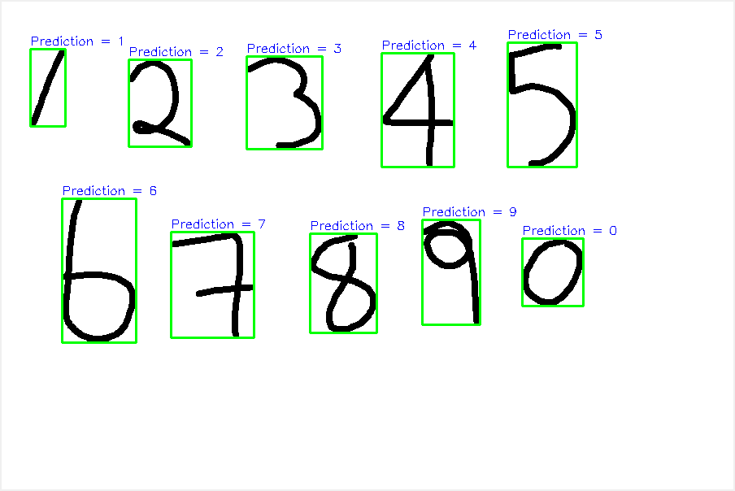

# Handwritten-digit-recognition
## Overview
### Ipython Notebook
The `Handwritten_Digit_Recogniton.ipynb` contains the code to train your CNN Model.

The Dataset used is MNIST Handwritten Digit Classification Dataset
### GUI.py
This .py file contains code for buliding a GUI.


## Prerequisites
Install all Python Libraries given in `requirements.txt` for the GUI.py

For virtualenv to install all files in the requirements.txt file.

1.  cd to the directory where requirements.txt is located
2.  activate your virtualenv
3.  run: `pip install -r requirements.txt` in your shell

## Screenshots




## Steps to run
1.  Put the `model.h5` file in working directory
2.  If you want to train your own model then do with help of `Handwritten_Digit_Recogniton.ipynb` else you can use the one provided.
3.  Copy the path to `model.h5` and paste it in `GUI.py`.
4.  Simply run GUI.py file from your terminal or any Python IDE.

## Trobleshooting
This was found while running on spyder IDE.
IF your app is behaving strangely and/or the predicted image is not showing then make sure you have automatic as graphic backend.

Steps:
```
1) Go to tools. 
2) Go to preferences 
3) Select Ipython Console. 
4) Go to graphics tab 
5) Under "graphics backend" section, select "automatic" as the backend type.

Then restart your kernel.
```
